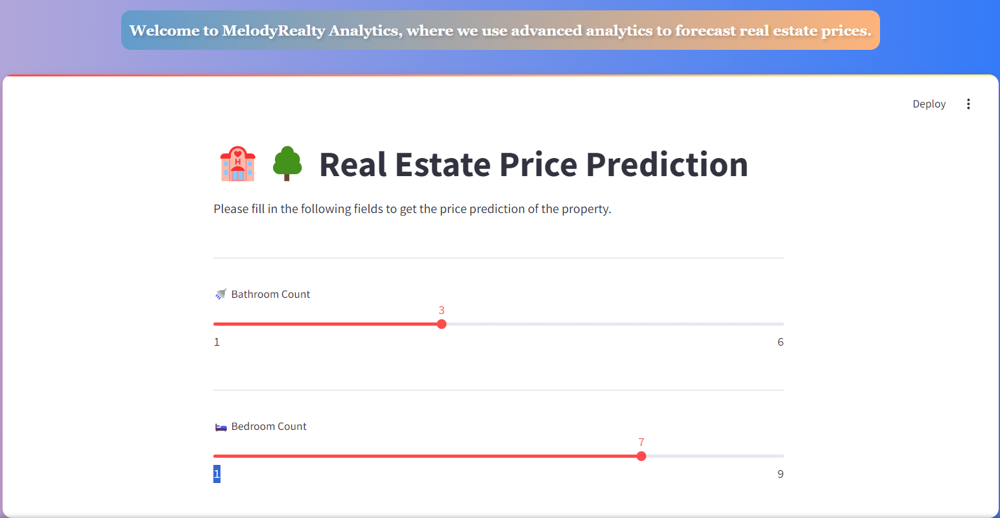

# 🏡 Real Estate Price Prediction - Web Interface

- Welcome to the **Real Estate Price Prediction** app! This application uses machine learning to predict real estate prices based on various property features.

- Built with Streamlit and a pre-trained RandomForest model, the app offers a user-friendly interface for accurate price estimation.

## 📊 Model Training and Evaluation

```python
# Load the dataset
df = pd.read_csv('final.csv')

# Separating features and target variable
X = df.drop('price', axis=1)
y = df['price']

# Splitting the data into training and test sets
X_train, X_test, y_train, y_test = train_test_split(X, y, test_size=0.2, random_state=42)

# Creating the RandomForestRegressor model
rf = RandomForestRegressor(n_estimators=100, random_state=42)

# Fitting the model to the training data
rf.fit(X_train, y_train)

# Making predictions
y_pred = rf.predict(X_test)

# Evaluating the model's performance
print("R^2:", r2_score(y_test, y_pred))
print("RandomForest Mean Squared Error:", mean_squared_error(y_test, y_pred))
print("RandomForest Mean Absolute Error:", mean_absolute_error(y_test, y_pred))

# Save the model as a pickle file
pickle.dump(rf, open("randomforest_model.pkl", "wb"))

# Load the model from the pickle file
with open('randomforest_model.pkl', 'rb') as file:
    model = pickle.load(file)

```
## ✨ Features

- **Interactive Form**: Input property details such as bathroom count, bedroom count, construction year, location, and more.

- **Price Prediction**: Receive instant property price predictions based on your inputs.

- **History of Predictions**: View and review past predictions and their corresponding input data.


## 🛠️ How It Works

1. **Input Details**: Fill in the form with property details including number of bathrooms, bedrooms, construction year, and other relevant information.

2. **Get Prediction**: Click on the "🔮 Predict" button to receive an estimated price for your property.

3. **View Predictions**: Check out the predicted price and review past predictions if needed.


## 🚀 Getting Started

1. **Clone the Repository**:
    ```bash
    git clone git@github.com:ezgitandogan/ImmoEliza-PredictionApp.git
    ```

2. **Navigate to the Project Directory**:
    ```bash
    cd ImmoEliza-PredictionApp
    ```

3. **Install Python Packages**:
    ```bash
    pip install -r requirements.txt
    ```

4. **Run the Application**:
    ```bash
    streamlit run app.py
    ```

5. **Access the Web Application**: Open your browser and go to `http://localhost:8501/` to interact with the application.

## 🌐 HTML Integration

- You can integrate the Streamlit app into an HTML page for easier access.

## 🔍 HTML Code

```html
<!DOCTYPE html>
<html lang="en">
<head>
    <meta charset="UTF-8">
    <meta name="viewport" content="width=device-width, initial-scale=1.0">
    <title>🔮 Real Estate Price Prediction</title>

    <style>
        body {
            font-family: 'Arial', sans-serif;
            background: linear-gradient(to right, #c0acd6, #2575fc);
            margin: 0;
            padding: 0;
            display: flex;
            justify-content: center;
            align-items: center;
            height: 100vh;
            flex-direction: column;
        }

        iframe {
            border: none;
            border-radius: 12px;
            padding: 0;
            width: 80%;
            height: 90%;
            box-shadow: 0 6px 12px rgba(214, 0, 0, 0.3);
            margin-top: 20px; 
            display: block;
            transition: transform 0.3s ease, box-shadow 0.4s ease;
        }

        iframe:hover {
            transform: scale(1.00); 
            box-shadow: 0 8px 16px rgba(233, 7, 7, 0.4);
        }

        footer {
            border-radius: 12px;
            bottom: 0;
            height: 20px;
            width: 100%;
            background-color: rgba(0, 0, 0, 0.3);
            opacity: 0.9;
            color: #000207;
            text-align: center;
            padding: 15px 0;
            box-shadow: 0 -2px 4px rgba(0, 0, 0, 0.2);
            z-index: 10;
            font-size: 1em;
            font-weight: bold;
        }

        h1 {
            padding: 15px; 
            margin: 20px 0; 
            font-size: 3em; 
            background: linear-gradient(to right, #cf6fbf, #feb47b);
            font-family: 'Arial', sans-serif; 
            font-weight: bold; 
            text-align: center; 
            text-shadow: 2px 2px 4px rgba(0, 0, 0, 0.2);
            border-radius: 12px;
            color: #080707;
        }

        p {
            margin: 0;
            font-size: 1em;
            font-weight: bold;
        }

        h2 {
            margin: 20px 0 10px 0; 
            font-size: 1.125em;
            color: #ffffff; 
            font-family: 'Georgia', serif; 
            line-height: 1.6; 
            text-align: justify; 
            background: linear-gradient(to right, #629ccc, #feb47b);
            border-radius: 12px;
            padding: 10px;
            text-shadow: 2px 2px 4px rgba(0, 0, 0, 0.2); 
        }

        span {
            color: #ffffff;
        }
    </style>

</head>
<body>
    <h2>Welcome to MelodyRealty Analytics, where we use advanced analytics to forecast real estate prices.</h2>
    <iframe src="http://localhost:8501/"></iframe>

    <footer>
        <p>&copy;2024 <span>MelodyRealty Analytics Company.</span> All rights reserved.</p>
    </footer>
</body>
</html>
```

### 📝 Explanation of Key Elements

- **Background and Layout**: 
  - The `body` element has a gradient background transitioning from light purple to dark blue.

  - Flexbox is used to center the content both vertically and horizontally, covering the full viewport height.

- **Embedded Application**:
  - The `iframe` tag embeds the Streamlit app into the page.

  - It features rounded corners and a subtle shadow for a modern look.

  - Includes a hover effect that increases the shadow and slightly scales the iframe for better user interaction.

- **Footer**:
  - Positioned at the bottom of the page.

  - Displays copyright information with a semi-transparent background and a subtle shadow.

### 📂 How to Use

1. **Save the HTML Code**:
   - Copy the provided HTML code into a file with a `.html` extension.

2. **Open in a Web Browser**:
   - Open the `.html` file in your preferred web browser.

3. **View the Application**:
   - The page will display the embedded Streamlit application with the styled header and footer.



[🔮 Real Estate Price Prediction - Web Interface](http://127.0.0.1:5500/index.html)

## 👥 Contributors

- [Ezgi Tandogan](https://github.com/ezgitandogan)

## 📅 Timeline

- This project created in 5 days.
